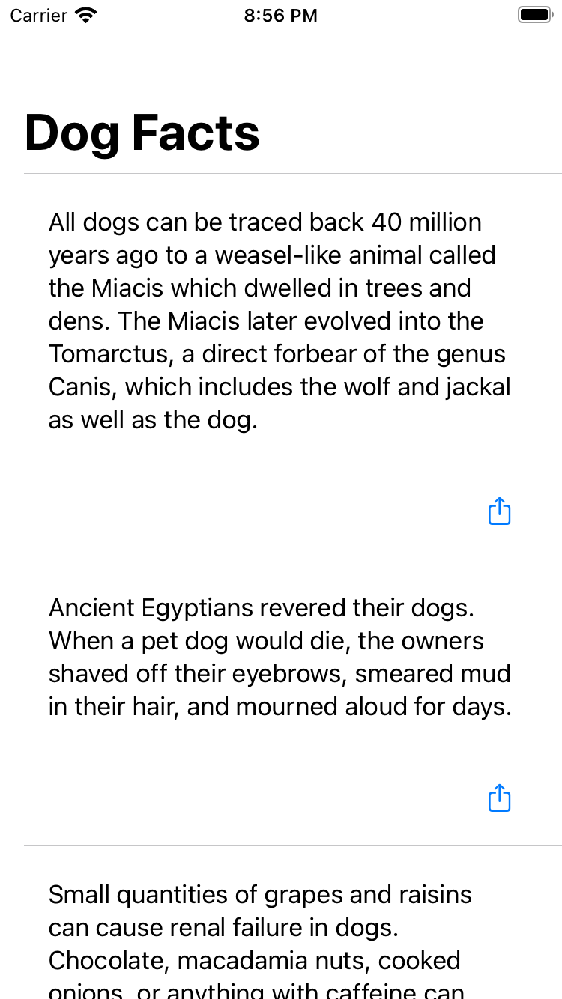
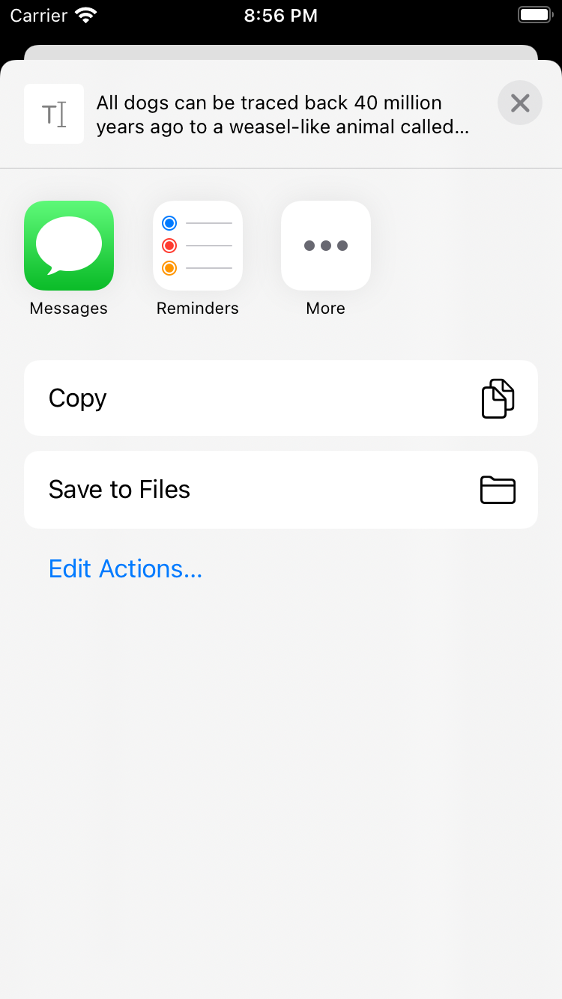

# Dogs

Fatos sobre cachorros fornecidos por [Dog facts API](https://github.com/DukeNgn/Dog-facts-API).

## Screenshots

  
  

## Começando

### Requisitos

Esta aplicação foi desenvolvida usando estas ferramentas e não possui garantia de que é possível utilizar versões mais antigas dos mesmos.
- Xcode 12.4
- Swift 5
- [Tuist](https://docs.tuist.io/tutorial/get-started)

### Como executar

1. Você deverá clonar o repositório
`$ git clone git@github.com:djorkaeffalexandre/Dogs.git`
2. Entrar na pasta do projeto
`$ cd Dogs`
3. Gerar o projeto Xcode
`$ make generate`
4. Abrir o projeto Xcode
`$ make open`

## Tuist

Estamos usando [Tuist](https://docs.tuist.io/tutorial/get-started) para gerar o projeto Xcode e os arquivos necessários para o projeto.
[Tuist](https://docs.tuist.io/tutorial/get-started) provê uma CLI simples de ser utilizada e remove a necessidade da manutenção de arquivos de projetos Xcode.
Para instalar o [Tuist](https://docs.tuist.io/tutorial/get-started) basta executar `$ bash <(curl -Ls https://install.tuist.io)`.

### Comandos

Para facilitar algumas ações foi criado um arquivo Makefile que possui alguns comandos comuns.

- Gerar os arquivos do projeto Xcode
`$ make generate`

- Abrir o projeto Xcode
`$ make open`

## Contact
Email: djorkaeff7@icloud.com
